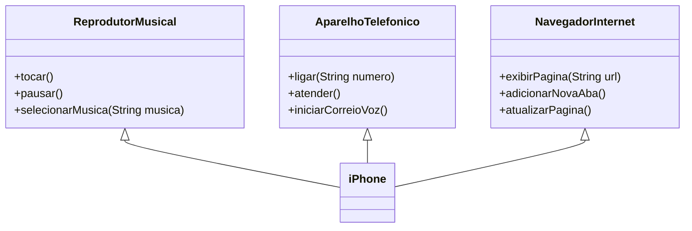

# trilha-java-basico
Desafios de java básico POO

Abaixo a UML do desafio de POO

```mermaid
classDiagram
	ReprodutorMusical <|-- iPhone
	AparelhoTelefonico <|-- iPhone
	NavegadorInternet <|-- iPhone
    class ReprodutorMusical{
      +tocar()
      +pausar()
      +selecionarMusica(String musica)
    }
    class AparelhoTelefonico{
      +ligar(String numero)
      +atender()
      +iniciarCorreioVoz()
    }
    class NavegadorInternet{
      +exibirPagina(String url)
      +adicionarNovaAba()
      +atualizarPagina()
    }
```

### Código fonte em java se encontra na pasta trilha-java-basico